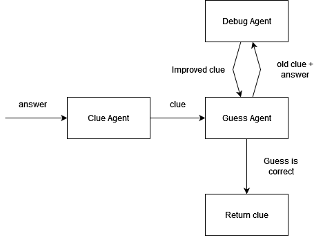

# xword: Automatic crossword puzzle generation via LLM Agents

This repository contains source code for my crossword generation project.

I explain how it works in my technical blog at `...`

## Usage
1. Setup environment and dependencies
```bash
pip install -r requirements.txt
```

2. Set up `config.yaml` with API keys and settings

3. Input `topic` to generate crossword on
```python
python scripts/main.py my_topic
```

4. A crossword with clues will be returned like:
```text
User Input Topic: SPORTS
8 out of 14 words generated used

F - G A M E - - - - 
O - - T - - - - - - 
O - - H O C K E Y - 
T - - L - O - - - - 
B A S E B A L L - - 
A - - T - C - - - - 
L - - I - H O S T - 
L - - C - - - - V - 
- - - - - - - - - - 
- - - - - - - - - - 

ACROSS:
(1, 3) - A contest of risks (4)
(3, 4) - Sport with sticks and pucks (6)
(5, 1) - America's pastime, batting around (8)
(7, 6) - One who greets at the door (4)
DOWN:
(1, 1) - Sport involving goals with kicks (8)
(1, 4) - Fit for sports, sounds like a competition (8)
(3, 6) - Mentor of teams (5)
(7, 9) - Small screen box (2)
```

## How it works
Read the technical blog at `...`.
1. Based on user input `topic`, we generate related words by taking top-k most similar words based on the specified static embedding model (default GloVe)
2. For each candidate word, we prompt an LLM to generate a clue in an agentic framework:
    - ClueAgent generates `clue_1` based on `answer`
    - GuessAgent attempts to guess `answer` based on `clue_1`
        - If successful, return `clue_1`
    - Else, `clue_1` and `answer` are sent to DebugAgent to improve the clue, obtaining `clue_2`
        - GuessAgent attempts to guess `answer` based on `clue_2`, and process repeats until timeout or successful guess.
3. With a list of `{answer: clue}` pairs, we generate the crossword iteratively.    




## Setting up config.yaml
```yaml
TBD
```

## Todo
- Make a playable crossword game with GUI etc, based on the output
- Improve on debugging agent
